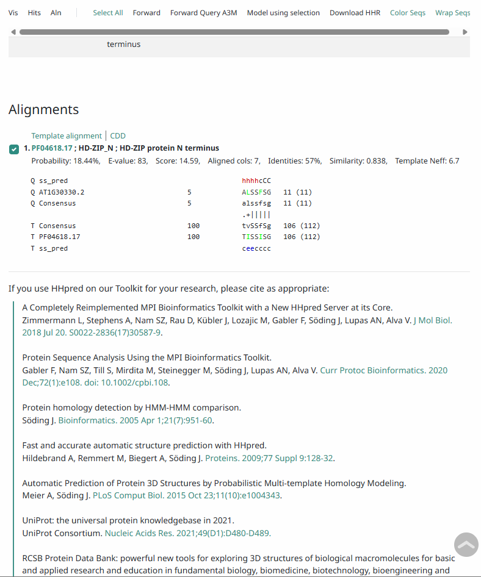
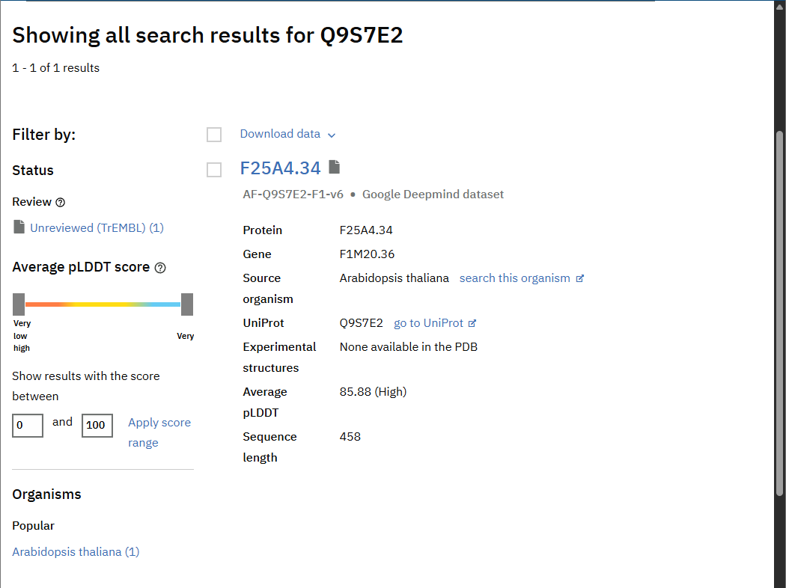

# Bioinformatic Final Project
Session 1: Annotation of coding sequences

---

##  Analysis Highlights

### 1. Structural Similarity (Exe 7)
Using the **HHpred** server, we identified a conserved match with the **HD-ZIP_N** domain (Pfam: PF04618.17).
* **Identity:** 57%
* **Probability:** 18.44%

---

### 2. Functional Annotation (Exe 9)
Gene Ontology (GO) terms were analyzed via **QuickGO** to define the protein's biological role.
* **Biological Process:** Response to water deprivation (GO:0009414).
* **Cellular Component:** Root hair (GO:0035618).

---

### 3. 3D Structural Modeling (Exe 10)
The 3D model was retrieved from the **AlphaFold Protein Structure Database** (UniProt: Q9S7E2).
* **Average pLDDT:** **85.88** (High Confidence).
* **Structural Fold:** Stable alpha-helical arrangement supporting DNA-binding activity.

---
WGCNA Analysis of Wheat Transcriptome Under Drought Stress

This project contains a Weighted Gene Co-expression Network Analysis (WGCNA) conducted on a wheat (Wheat W) dataset to identify gene modules associated with drought stress responses.
1. Project Overview

    Dataset: RNA-Seq data from 26 wheat samples under various drought conditions.

    Input Data: 9,940 isoforms/genes were analyzed after pre-processing and filtering.

2. Analysis Workflow (Session 3)
3.1 & 3.2) Data Preparation and Outlier Detection

    Sample clustering was performed to identify potential outliers.

    The dataset was confirmed to be clean and ready for network construction.

3.3) Soft-Thresholding Power Selection

    A soft-thresholding power of 6 was chosen as it reached the scale-free topology fit index (R2) above 0.8.

    This power value balances the scale-free topology and mean connectivity.

3.4) Module Identification

    Automatic network construction and module detection were performed using the blockwiseModules function.

    A total of 41 modules were identified, represented by different colors.

3.5) Hub Gene Identification

    Intra-modular connectivity was calculated to identify "Hub Genes" (highly connected isoforms) for each module.

    For the Cyan module, the top hub isoform was identified as a key regulator.

3.6) Module-Trait Relationship

    Modules were correlated with external traits such as "blwgrd" (Below Ground Biomass).

    The Violet module showed a significant correlation with drought-related traits. (Note: Ensure you upload the PNG version of your heatmap PDF)

3. Repository Contents

    Practical_WGCNA_W_dataset(1).Rmd: The complete R source code for the analysis.

    net_W.RData: R Data file containing the saved network and module results.

    Genes_per_module_W.tsv: List of all genes and their assigned module colors.

    TPM_counts_Drought_W_dataset.csv: The normalized expression data used for the study.

## Conclusion
The integration of HMM-based domain searches, GO annotations, and AlphaFold modeling confirms that **AT1G30330.2** is a functional **HD-ZIP transcription factor** involved in plant stress response and developmental regulation.
